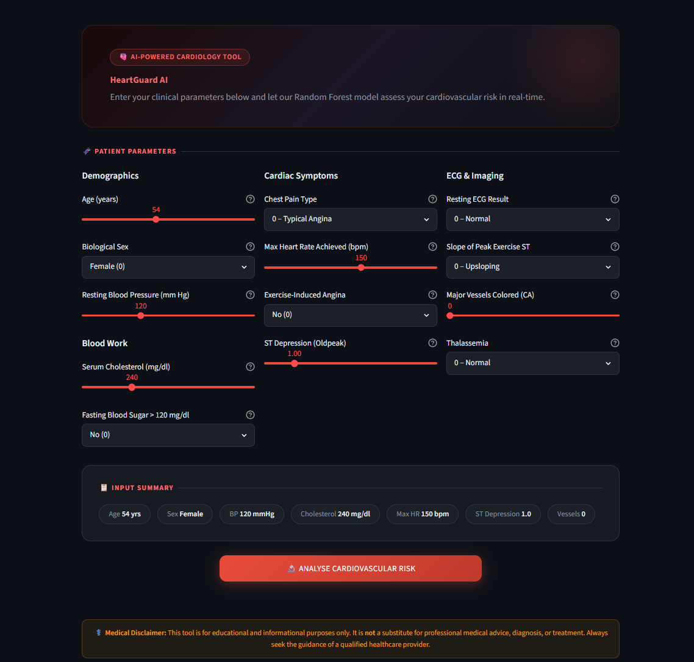
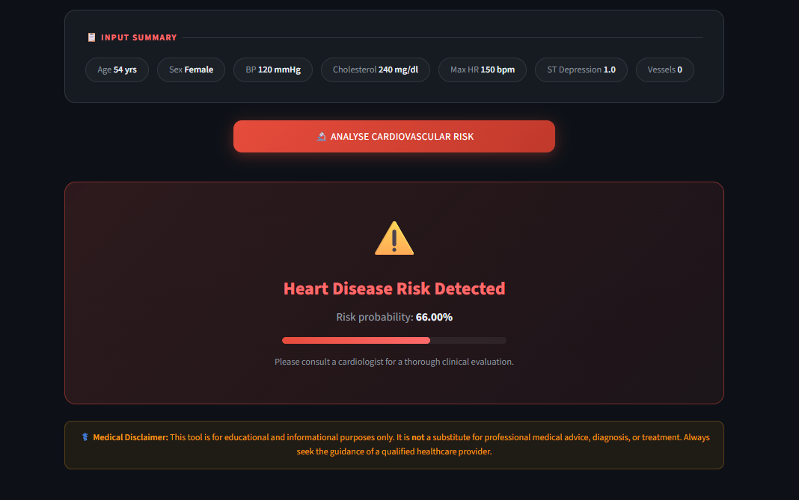
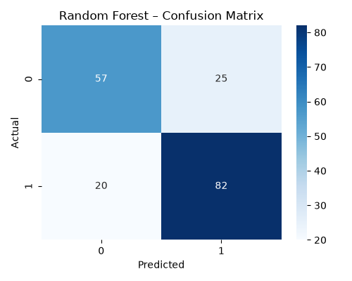
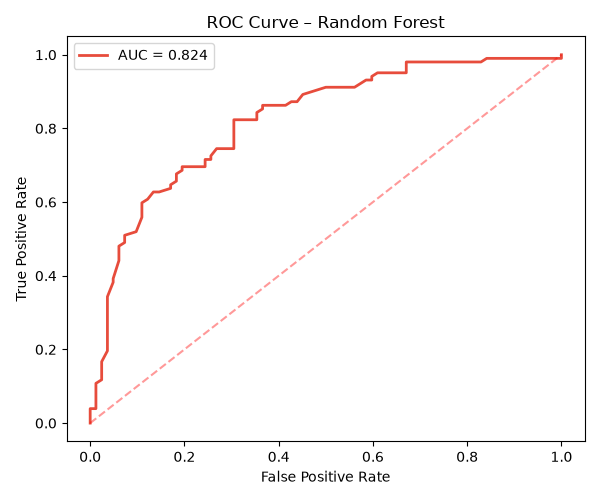

# ❤️ HeartGuard AI – Heart Disease Predictor

HeartGuard AI Ver 1.0 is a machine learning-powered web application designed to assess cardiovascular disease risk using patient clinical parameters. Built with Scikit-learn and Streamlit, the system leverages a Random Forest classifier to provide real-time predictions through an interactive, dark-themed dashboard.

---

## 🚀 Quick Start

```bash
# 1. Install dependencies
pip install -r requirements.txt

# 2. Train the model (saves model.pkl + features.pkl to /models)
python train.py

# 3. Launch the web app
streamlit run app.py
```

---

## 🤖 ML Algorithms

| Model | Description |
|-------|-------------|
| Logistic Regression | Baseline linear classifier |
| Decision Tree | Interpretable tree-based model |
| **Random Forest** | **Best model – used for predictions** |

---

## 📊 Metrics & Outputs

- Model accuracy comparison across all 3 models
- Confusion Matrix → `images/confusion_matrix.png`
- ROC Curve with AUC score → `images/roc_curve.png`
- Trained model → `models/model.pkl`
- Feature list → `models/features.pkl`

---

## 📸 Application Screenshots

### 🏠 HeartGuard AI Interface

<p align="center">

</p>

<p align="center">
<i>Modern dark-themed Streamlit interface with interactive clinical parameter inputs and real-time cardiovascular risk assessment.</i>
</p>

---

### ❤️ Risk Prediction Example

<p align="center">

</p>

<p align="center">
<i>Example prediction showing detected cardiovascular risk with confidence probability and clinical recommendation.</i>
</p>

---

### 📊 Confusion Matrix

<p align="center">

</p>

<p align="center">
<i>Confusion Matrix of the Random Forest classifier used for heart disease prediction.</i>
</p>

---

### 📈 ROC Curve

<p align="center">

</p>

<p align="center">
<i>Receiver Operating Characteristic (ROC) curve illustrating the model's classification performance with AUC.</i>
</p>

---

## 🗂️ Dataset

UCI Heart Disease dataset (`datasets/heart.csv`)

**Target Column:** `num`

- `0` → No Disease
- `1–4` → Disease Present

The multiclass target is converted into a binary classification problem.

---

## 🛠️ Tech Stack

### Machine Learning
- Scikit-learn
- Pandas
- NumPy

### Data Visualization
- Matplotlib
- Seaborn

### Frontend
- Streamlit (Premium Dark UI)

### Model Persistence
- Joblib

---

## 📁 Project Structure

```bash
HeartGuard-AI/
│
├── app.py
├── train.py
├── requirements.txt
├── README.md
│
├── datasets/
│   └── heart.csv
│
├── images/
│   ├── home.png
│   ├── prediction_risk.png
│   ├── confusion_matrix.png
│   └── roc_curve.png
│
├── models/
│   ├── model.pkl
│   └── features.pkl
│
└── venv/
```

---

## ⚕️ Disclaimer

This application is intended for **educational and informational purposes only**.

It is **not a substitute for professional medical advice, diagnosis, or treatment**.

Always consult a qualified healthcare provider regarding any medical concerns.

---

## ⭐ Future Improvements

- SHAP Explainability
- Hyperparameter Tuning
- XGBoost Integration
- PDF Medical Report Generation
- Patient History Tracking
- Cloud Deployment

---


## 👨‍💻 Author

**Rajwant Raj**

- 🎓 B.Tech CSE Student, Uttaranchal University
- 🤖 AI/ML Enthusiast
- 💻 Passionate about Machine Learning, Deep Learning, and Healthcare AI

GitHub: https://github.com/rajwant-raj

---

**Developed with ❤️ using Python, Scikit-learn, and Streamlit.**
